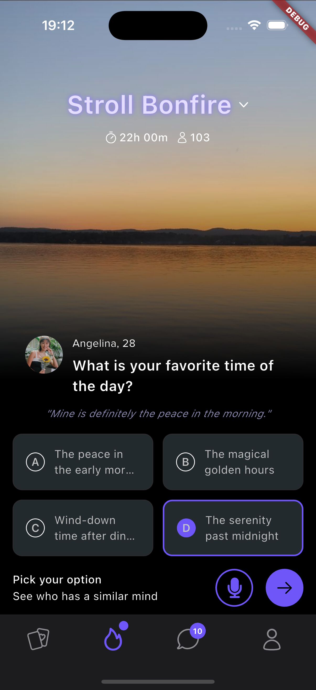

# Stroll Bonfire Screen

A Flutter implementation of the Stroll Bonfire screen design from Figma.

## Getting Started

1. Clone the repository
2. Install dependencies
3. Run the app

## Features
- Responsive background image with gradient overlay
- Interactive option selection
- Custom fonts (Proxima Nova)
- SVG icon support
- Riverpod state management